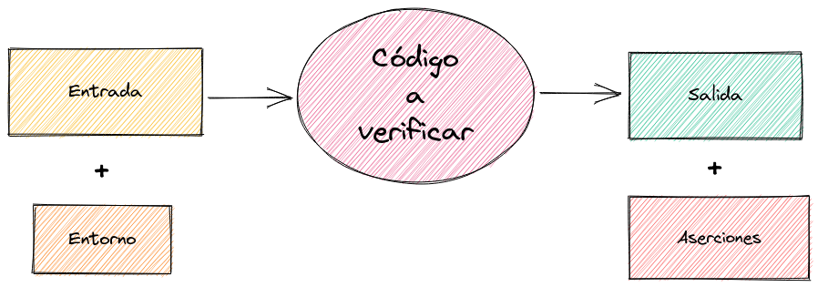

# Testing basado en propiedades


## Quién soy

**Roberto Serrano**

Desarrollo backend en Scala

Trabajo en remoto para [47 degrees](https://www.47deg.com/)

<p>
  <strong>bilki</strong> @
  <a href="https://twitter.com/bilki"><i class="fa-brands fa-twitter-square"></i></a>
  <a href="https://github.com/bilki"><i class="fa-brands fa-github-square"></i></a>
</p>


### ¿Por qué escribimos tests?

Verificación <i class="fa-solid fa-magnifying-glass"></i>
<!-- .element: class="fragment" data-fragment-index="1" -->

Documentación <i class="fa-solid fa-book"></i>
<!-- .element: class="fragment" data-fragment-index="2" -->

Note:
1. Preguntar a la audiencia por sus razones, ¿añadirían alguna más?
2. La verificación es comprobar que efectivamente el software hace lo que queremos que haga (ojo, también importa cómo lo haga)
3. La documentación es un subproducto de la especificación de las verificaciones (los requisitos)
4. El código es el *cómo*, los tests el *qué*


### Tipos de tests

* Unitarios
* Integración
* E2E
* Smoke
* Aceptación
* Golden
* UI
* Performance
* Chaos
* ...


Note:
1. Con cada tipo buscamos cubrir una necesidad distinta de verificación
2. Habitualmente, se habla de una pirámide de testing, con los unitarios en la base, etc. No entraremos en esa discusión, porque hay diversidad de opiniones al respecto


### ¿Qué es un test?



Note:
1. La entrada se entiende dentro de un contexto (entorno)
2. Las aserciones se comprueban sobre la salida
2. ¿Qué es lo más importante de un test? Aparentemente, deberían ser las aserciones sobre la salida, ¿no?


### Estructura de un test

(Casi) todos los componentes de la definición

```scala mdoc:invisible
import munit.FunSuite

def factorial(n: Int): Int =
  if (n <= 1) 1 else n * factorial(n - 1)
```

```scala mdoc
class FactorialSuite extends FunSuite {
  test("Factorial zero base case") {
    val input     = 0                 // Entrada
    val expected  = 1                 // Resultado esperado
    val result    = factorial(input)  // Salida
    assertEquals(result, expected)    // Aserción
  }
}
```

Note:
1. El entorno en este caso es vacío, no dependemos de nada externo a la entrada como pudiera ser una bbdd, la red o un reloj
2. Un test basado en propiedades no tendrá una estructura básica muy distinta a esta


### Entrada

Consideremos la entrada a una función

| Tipo      |                                         | Habitantes                  |
|-----------|-----------------------------------------|-----------------------------|
|`Boolean`  | <i class="fa-solid fa-arrow-right"></i> | `True \| False`             |
| `Int`     | <i class="fa-solid fa-arrow-right"></i> | `[-2147483648, 2147483647]` |
| `String`  | <i class="fa-solid fa-arrow-right"></i> | `???`                       |
<!-- .element: class="fragment" data-fragment-index="1" -->

Note:
1. La unidad mínima verificable es la función
2. ¿Alguien puede decirme el número de habitantes del tipo String?
3. Si la función tiene varios argumentos, multiplicamos el número de habitantes de todos sus tipos (producto cartesiano)
4. Por no hablar de otros tipos mucho más complejos, e incluso objetos mutables


### Entrada

<i class="fa-solid fa-clipboard-question"></i> \
¿Cuántos tests son suficientes?

Note:
1. ¿A ojo? ¿Alguna heurística?


### Entrada

Cobertura de código determinada por la entrada

<i class="fa-solid fa-clipboard-question"></i> \
¿Tests necesarios para una cobertura completa?
<!-- .element: class="fragment" data-fragment-index="1" -->

Tantos como habitantes en el tipo de entrada
<!-- .element: class="fragment" data-fragment-index="2" -->

Note:
1. La cobertura de código es determinada por el número y calidad de ejemplos que proveamos
2. Inabarcable utilizar todos los posibles valores para la entrada -> ejecutar el programa para todos ellos
3. Valores significativos/interesantes


### Aserción

Ejecutamos el código a verificar

¿Se cumple el predicado?

```scala mdoc
def sum(x: Int, y: Int): Int = x + y

//          >---------vv-<
val zero  = sum(0, 0) == 0
val two   = sum(1, 1) == 2
```
<!-- .element: class="fragment" data-fragment-index="1" -->

Note:
1. Ejecutar la función con la entrada
2. La aserción tiene la forma de un predicado, una igualdad, donde un lado es la salida real, y el otro lado es la salida esperada
3. El valor resultante de la aserción es verdadero o falso: cuando es falso significa que el código es incorrecto


### Tests basados en ejemplos

Muy directos <i class="fa-solid fa-thumbs-up"></i>

Entrada y salida manuales <i class="fa-solid fa-thumbs-down"></i>

```scala mdoc:reset
def factorial(n: Int): Int =
  if (n <= 1) 1 else n * factorial(n - 1)

val f0 = factorial(0) == 1
val f1 = factorial(1) == 1
val f4 = factorial(4) == 24
```
<!-- .element: class="fragment" data-fragment-index="1" -->

Note:
1. Se adecúa muy bien al razonamiento humano, biológicamente estamos programados para aprender mediante ejemplos
2. Dicha habilidad incluye la capacidad para reconocer patrones, a partir de dichos ejemplos (lo veremos más adelante)
3. El número de ejemplos puede dispararse rápidamente, ¡no hay forma de escribirlos todos!


### Propiedad matemática

> Una propiedad `p` para todos los elementos de un conjunto `X` normalmente se define como \
`p: X -> {true, false}`

> O bien como el subconjunto de `X` para cuyos elementos la propiedad evalúa a verdadero \
`{x | p(x) = true}`


### Propiedad matemática - Ejemplo

Conmutatividad

> **`x * y = y * x`** \
∀ x, y ∈ `S`

Note:
1. Conmutatividad para una operación definida `*` y elementos pertenecientes a un conjunto `S`


### Generadores
* Generadores por defecto
* Generadores personalizados


### Estrategias


### Fuentes

| Título    |   Autor                                 |
|-----------|-----------------------------------------|
| [User Guide](https://github.com/typelevel/scalacheck/blob/main/doc/UserGuide.md) | Scalacheck |
| [The lazy programmer's guide to writing thousands of tests](https://www.youtube.com/watch?v=IYzDFHx6QPY) | Scott Wlaschin |
| [Property-Based Testing: Let Your Testing Library Work for You](https://www.youtube.com/watch?v=pO4_3kg1wMw) | Magda Stożek |
| [Property (mathematics)](https://en.wikipedia.org/wiki/Property_(mathematics)) | Wikipedia |